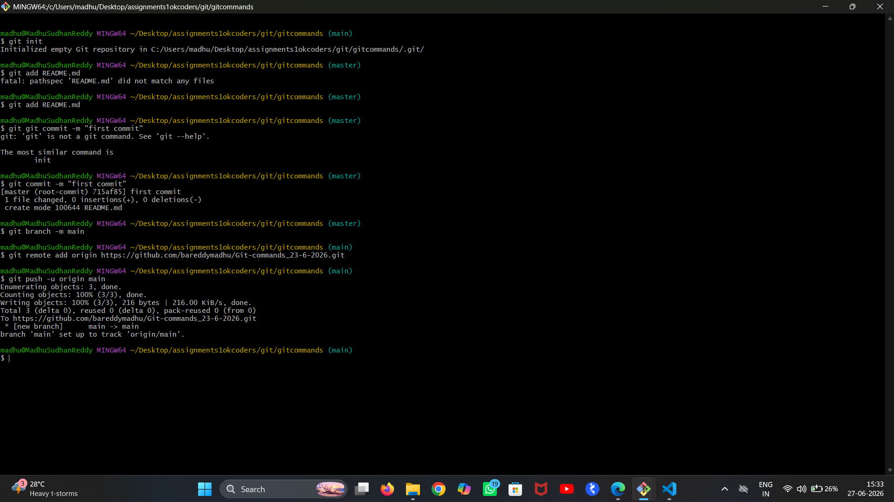

# Create a new file named README.md and add some basic information about your project.
# Use Git to stage and commit the README.md file with a meaningful commit message.
# Make some changes to the README.md file and commit these changes with another meaningful commit message.
